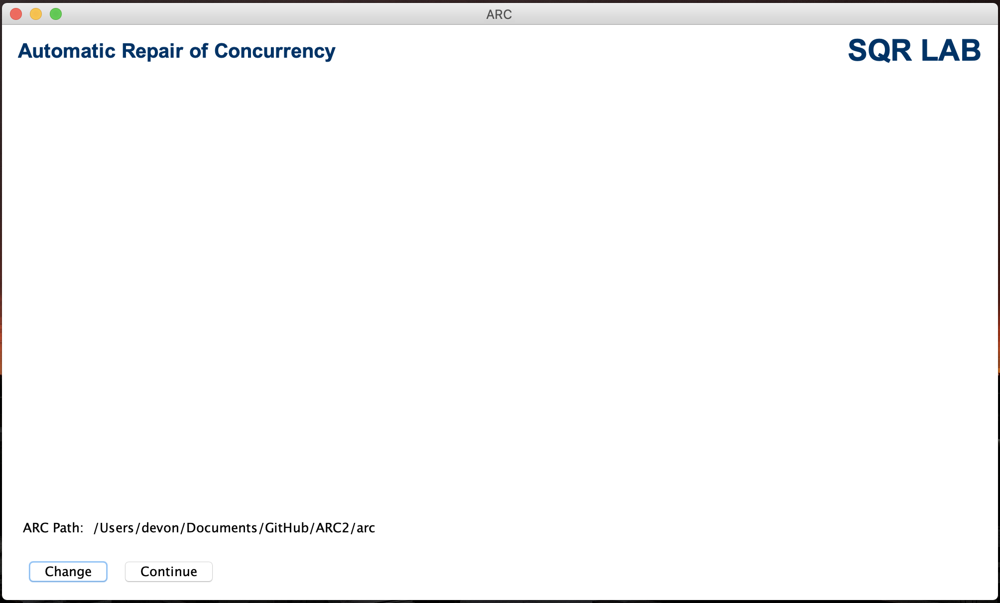
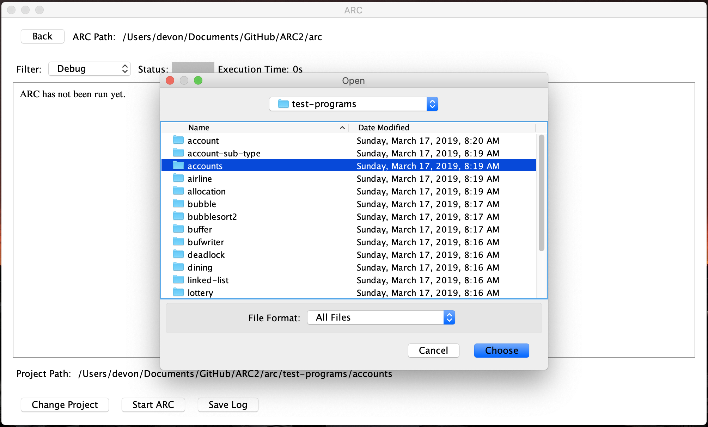
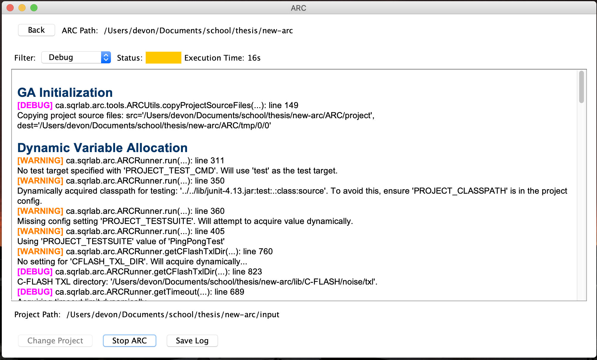
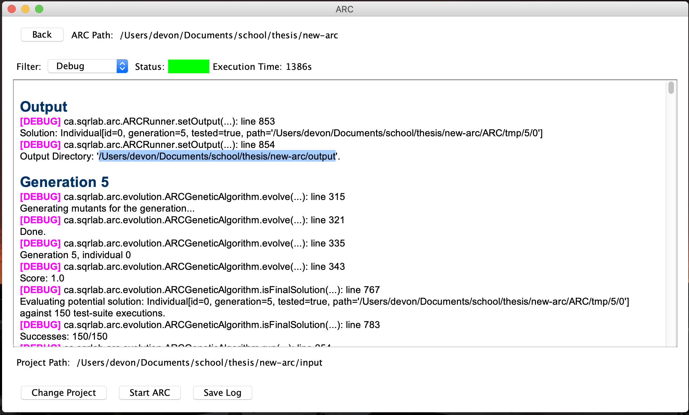

# ARC2
A Java implementation of the ARC-OPT bug repair framework.

## Authors
- [Devon McGrath](https://github.com/DevonMcGrath)

## Introduction
ARC2 (Automatic Repair of Concurrency) is a program which is designed to automatically repair two common concurrency bugs: data-races and deadlocks. ARC2 takes a Java project which exhibits concurrency bugs and a set of JUnit test cases, and attempts to create a version which exhibits no concurrency bugs (based on the test-suite provided).

ARC2 uses a genetic algorithm to attempt to find a fixed program. In the genetic algorithm, there is a number of TXL mutation operators which are used to create mutated versions of the project. The individuals are evaluated against a fitness function and the best individuals continue to the subsequent generation. This continues until either a fix is found or ARC2 reaches the max number of generations.

## Dependencies
### Programs
#### TXL
TXL is a source transformation language, which ARC2 uses to mutate the project and implement source-code level noising via C-FLASH.

TXL can be downloaded [here](http://txl.ca/txl-download.html).

#### ANT
Ant is required for mainly compiling the source code.

#### Java
Java is required to start ARC2, use ant, and test the programs with JUnit.

### Files and Libraries
All required files and libraries should be located within the ARC directory's `lib` folder.

#### TXL Mutation Operators
The TXL mutation operators are required for ARC2's genetic algorithm. They do the actual Java source code transformation.

Note: these files are provided as part of the repository and are located in `arc/lib/TXL`.

#### JUnit
JUnit is required to execute the test-suite for the project.

#### C-FLASH
To ensure many different thread schedules are explored, ARC2 noises programs at the source code level using C-FLASH.

## Running ARC2
1. In either the terminal or system file explorer, navigate to the `arc` directory.
1. If using the terminal, run `java -jar arc2.jar`. Otherwise, double-click `arc2.jar`.

### Selecting the ARC Directory
The ARC directory is a directory which contains an `arc-prog-config.txt` file. By default, ARC2 selects the current working directory and if ARC2 was started using the above instructions, a config file already exists.

Once a directory is selected with the `arc-prog-config.txt` file, you will be able to continue to the next screen by clicking `Continue`.

### Selecting a Project
After clicking `Continue` on the main screen, you will now be able to select the project you want to run ARC2 with. A valid ARC2 project has the following:
- An Ant `build.xml`
- A set of `JUnit` test-suites
- An ARC2 project config file, `arc-config.txt`

ARC2 will automatically search the selected ARC directory for projects and if it finds one, it will automatically set the project directory to that directory.

For the user's convenience, numerous [test programs](arc/test-programs) have been provided which have already been setup with all the required files.

### Executing the ARC2 Genetic Algorithm
Once a valid project directory is selected, you can now start running the ARC2 genetic algorithm. Simply click `Start ARC`.

ARC2 can be stopped at any time by clicking `Stop ARC`. ARC2 will not stop immediately but there are numerous points where ARC2 checks if it should stop executing.

In addition, at any time the current log can be saved by clicking `Save Log`. An HTML file will be saved in the ARC directory and opened by the default browser.

## Final Output
If ARC2 is able to find a valid solution which meets extended testing requirements, the status colour will turn green. The individual which was found to be the solution will also be copied to an output directory - which will be denoted in the log.

